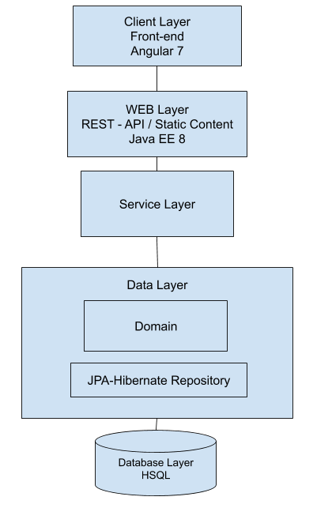

# todo-angular-spring-boot

# Architecture Diagram

In the Web Layer There are two Controllers:

    - Rest to Serve the API Requests
    - Normal Controller for the static content like Angular Files.

# Domain 

	Todo:
    - id
    - description
    - done
    - targetDate
    - lastUpdate
    - comment
    - username

# Technologies:

    Angular 7, Java EE 8,  Spring Framework, Spring Boot-Tomcat,  Spring Security, JPA-Hibernate, HSQL 
    (all the latest available ones).

    As I use Spring Boot, you can  either deploy the war or use the command line in the source folder 
    of the backend :
	    # mvn spring-boot:run

# Security (Spring-Security):
    JWT (Jason Web Token) Http Auth: (User: daniel, password: dummy)
